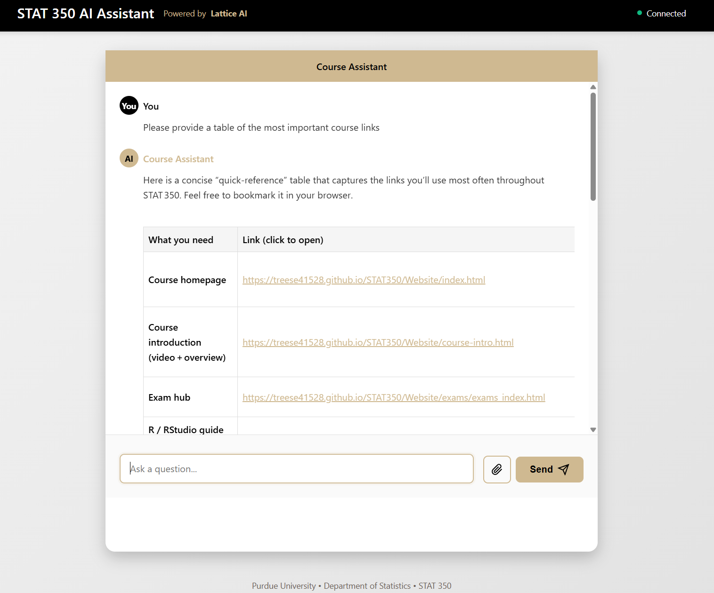

# GenAI Studio - Course Chat Application



A customizable Flask-based AI chat application for Purdue University courses, providing students with an intelligent assistant powered by custom models from Purdue GenAIStudio. This application is currently configured for STAT 350 but can be easily adapted for any Purdue course.

## Features

- ✅ **AI-Powered Chat** - Real-time responses from gpt-stat350 model with STAT 350 knowledge base
- ✅ **Persistent Conversations** - SQLite database storage with conversation history
- ✅ **File Upload Support** - Upload and analyze PDFs, CSV, Excel, text files
- ✅ **Multi-User Support** - Session-based user isolation
- ✅ **Rich Content** - LaTeX rendering, Markdown support, code highlighting
- ✅ **Conversation Management** - Create, view, delete, and export conversations

## Quick Start

### Prerequisites

- Python 3.8+
- Purdue GenAI API key

### Installation

```bash
# Install dependencies
pip install -r requirements.txt

# Set your API key
export GENAI_API_KEY="your-api-key-here"

# Initialize database
python3 -c "from genaiStudio_app_database import app, db; app.app_context().push(); db.create_all(); print('✅ Database initialized')"

# Run the application
python3 genaiStudio_app_database.py
```

The application will be available at **http://localhost:5000**

### Production Deployment

For production, use Gunicorn:

```bash
gunicorn -w 4 -b 0.0.0.0:5000 --timeout 120 genaiStudio_app_database:application
```

## Customizing for Your Course

This application can be easily customized for any Purdue course by following these steps:

### Step 1: Create Your Custom Model in Purdue GenAIStudio

1. Navigate to **https://genai.rcac.purdue.edu**
2. Log in with your Purdue credentials
3. Click on **"Create New Model"** or **"Fine-tune Model"**
4. Upload your course materials:
   - Lecture notes (PDF, Word, Markdown)
   - Textbook chapters
   - Code examples
   - Assignment solutions
   - Study guides
5. Name your model (e.g., `gpt-cs180`, `gpt-ma162`, `gpt-bio110`)
6. Wait for the model to be trained/indexed
7. Copy your model name - you'll need this for configuration

### Step 2: Get Your API Key

1. Go to **https://genai.rcac.purdue.edu/api-keys**
2. Generate a new API key
3. Copy the key and save it securely
4. Set it as an environment variable:
   ```bash
   export GENAI_API_KEY="your-api-key-here"
   ```

### Step 3: Customize the Configuration

The application uses `config.yaml` for customization. A template is provided in the repository.

**Edit `config.yaml`** and update these key sections:

```yaml
# Your course information
course:
  name: "CS 180"                    # Change to your course
  department: "Computer Science"    # Change to your department
  college: "College of Science"     # Change to your college

# Your custom model
genai:
  model: "gpt-cs180"               # Use YOUR model name from GenAIStudio

# Customize the assistant
assistant:
  name: "CS 180 Helper"            # Name your assistant
  welcome_message: "Ready to help with Java and programming!"
```

**Complete configuration options in `config.yaml`:**
- **Course Information**: Name, department, college
- **Assistant Branding**: Name, title, welcome message
- **GenAI Settings**: Model name, temperature, response length
- **File Upload**: Enable/disable, file types, size limits
- **Features**: LaTeX, Markdown, code highlighting
- **Security**: Rate limiting, session timeout
- **Database**: SQLite or PostgreSQL

### Step 4: Customize File Types (Optional)

If your course uses specific file types (e.g., R for statistics, Java for programming):

```yaml
file_upload:
  allowed_extensions:
    - .txt
    - .pdf
    - .py      # Python files
    - .java    # Java files
    - .r       # R scripts
    - .cpp     # C++ files
```

### Step 5: Test Your Configuration

```bash
# Verify your config is valid
python3 -c "import yaml; yaml.safe_load(open('config.yaml'))"

# Check API connection
python3 genaiStudio_app_database.py &
curl http://localhost:5000/health
```

### Example Configurations

#### Example 1: CS 180 (Java Programming)
```yaml
course:
  name: "CS 180"
  department: "Computer Science"
genai:
  model: "gpt-cs180"
file_upload:
  allowed_extensions: [.txt, .pdf, .java, .py, .md]
```

#### Example 2: MA 162 (Calculus)
```yaml
course:
  name: "MA 162"
  department: "Mathematics"
genai:
  model: "gpt-ma162"
features:
  latex_rendering: true  # Important for math!
```

#### Example 3: BIOL 110 (Biology)
```yaml
course:
  name: "BIOL 110"
  department: "Biological Sciences"
genai:
  model: "gpt-bio110"
file_upload:
  allowed_extensions: [.txt, .pdf, .csv, .xlsx]  # For lab data
```

## Architecture

### Backend
- **Framework**: Flask 3.0 with SQLAlchemy
- **Database**: SQLite (default) or PostgreSQL
- **API**: Purdue GenAI API (genai.rcac.purdue.edu)
- **File Processing**: PyPDF2, pandas for PDF/Excel/CSV

### Frontend
- **Template**: Single-page HTML with embedded JavaScript
- **Styling**: CSS with Purdue branding colors
- **Libraries**: KaTeX for LaTeX rendering

### Database Schema

**Conversations Table**
- id (UUID), user_id, created_at, updated_at, title
- Stores conversation metadata

**Messages Table**
- id, conversation_id, role (user/assistant), content, created_at
- Stores individual chat messages

## Usage

### Sending Messages
1. Type your question in the input field
2. Press Enter or click Send
3. View AI response with citations from course materials

### Uploading Files
1. Click the attachment button
2. Select a file (PDF, TXT, CSV, XLSX, JSON, MD, PY)
3. Ask questions about the file content
4. Files are automatically processed and sent to the AI

### Managing Conversations
- Conversations persist across sessions
- Refresh the page to see conversation history
- Each conversation has a unique ID

## API Endpoints

### Chat
- `POST /chat` - Send message (JSON or multipart/form-data)
  - Body: `{conversation_id: null|uuid, message: string, files: optional}`
  - Returns: `{content: string, conversation_id: uuid}`

### Conversations
- `GET /conversations` - List all user conversations
- `GET /conversations/<id>` - Get specific conversation with messages
- `DELETE /conversations/<id>` - Delete conversation
- `GET /conversations/<id>/export` - Export as JSON

### Utility
- `GET /health` - Application health check
- `GET /stats` - Usage statistics
- `POST /clear-session` - Clear user session

## Configuration

The application is configured using `config.yaml` in the project root. A comprehensive template is provided with the application.

### Key Configuration Sections

```yaml
# Course and branding
course:
  name: "STAT 350"
  department: "Department of Statistics"

# GenAI API settings
genai:
  base_url: "https://genai.rcac.purdue.edu"
  model: "gpt-stat350"  # YOUR CUSTOM MODEL NAME
  temperature: 0.7
  max_tokens: 2000

# Database settings
database:
  type: sqlite
  sqlite_path: conversations.db
  conversation_retention_days: 90

# File upload settings
file_upload:
  enabled: true
  max_size_mb: 10
  allowed_extensions: [.txt, .pdf, .csv, .xlsx, .json, .py, .md]
```

**To customize:** Edit `config.yaml` with your course details and model name. See the "Customizing for Your Course" section above for detailed instructions.

**Environment Variables:**
- `GENAI_API_KEY` (required): Your Purdue GenAI API key
- `CONFIG_FILE` (optional): Path to custom config file (default: `config.yaml`)
- `SECRET_KEY` (optional): Flask secret key for sessions

## Database Management

```bash
# Initialize database
flask --app genaiStudio_app_database init-db

# View statistics
flask --app genaiStudio_app_database db-stats

# Cleanup old conversations
flask --app genaiStudio_app_database cleanup-db
```

## Troubleshooting

### "No message provided" Error
- **Fixed**: Improved JSON parsing with defensive error handling
- Check browser console (F12) for detailed error messages

### API Connection Issues
- Verify `GENAI_API_KEY` environment variable is set
- Check API endpoint: `https://genai.rcac.purdue.edu/api/chat/completions`
- Ensure model `gpt-stat350` is accessible

### File Upload Errors
- Files are limited to 10MB
- Supported formats: TXT, PDF, CSV, XLSX, JSON, PY, MD
- Long files are automatically truncated to 50,000 characters

### Database Issues
- Delete `instance/conversations.db` and reinitialize to reset
- Check write permissions on `instance/` directory

### Configuration/Customization Issues

**"Model not found" or "Model not accessible" errors:**
- Verify your model name exactly matches what's in GenAIStudio
- Check that the model is published and accessible
- Ensure your API key has permissions to access the model
- Test the model directly in GenAIStudio web interface first

**Config changes not taking effect:**
- Restart the application after editing `config.yaml`
- Verify YAML syntax (indentation matters!)
- Check for typos in configuration keys
- Validate with: `python3 -c "import yaml; print(yaml.safe_load(open('config.yaml')))"`

**File uploads not working for custom file types:**
- Add extension to `config.yaml` under `file_upload.allowed_extensions`
- Ensure file size is under `max_size_mb` limit
- Check that required libraries are installed (PyPDF2 for PDFs, pandas for Excel)

**Custom model responses seem generic:**
- Your knowledge base may not be properly indexed in GenAIStudio
- Try uploading more specific course materials
- Increase the amount of course-specific content
- Test queries directly in GenAIStudio to verify model behavior

## Development

### Project Structure
```
GenAIStudio API/
├── genaiStudio_app_database.py  # Main application
├── deploy_database.sh           # Deployment script
├── requirements.txt             # Dependencies
├── templates/
│   └── index.html              # Frontend template
├── static/                     # Static assets
├── instance/
│   └── conversations.db        # SQLite database
├── logs/
│   └── assistant.log           # Application logs
└── uploads/                    # Temporary file uploads
```

### Adding Features
1. Read the code in `genaiStudio_app_database.py`
2. Database models are defined using SQLAlchemy
3. Routes use Flask blueprints
4. Frontend is a single HTML file with embedded JS/CSS

### Logging
Application logs are stored in `logs/assistant.log`:
```bash
tail -f logs/assistant.log
```

## Security

- **Rate Limiting**: 30 requests/minute, 500 requests/hour per user
- **Session Management**: Secure session cookies with timeout
- **File Upload**: Secure filename handling, size limits, extension validation
- **User Isolation**: Session-based user IDs prevent data leakage
- **API Key**: Stored as environment variable, never in code

## Performance

- **Database**: SQLite for simplicity, PostgreSQL for production scale
- **Caching**: Python bytecode caching enabled
- **File Processing**: Files processed in memory, automatically cleaned up
- **Conversation Memory**: Last 50 messages per conversation sent to API

## Course Integration

This application integrates with Purdue GenAIStudio custom models. The current configuration uses **gpt-stat350** for STAT 350, which includes:
- Custom knowledge base with all course materials
- Chapter-by-chapter content from course website
- R code examples and tutorials
- Worksheet solutions and explanations
- Exam preparation resources

### Creating Your Own Course Model

To create a custom model for your course in Purdue GenAIStudio:

1. **Gather Course Materials**:
   - Lecture slides and notes
   - Textbook chapters (if copyright allows)
   - Lab/assignment instructions
   - Solution guides
   - Practice problems
   - Code examples
   - Study guides

2. **Organize Materials**:
   - Convert everything to text-readable formats (PDF, DOCX, TXT, MD)
   - Structure content by topic/chapter
   - Include clear headings and labels

3. **Upload to GenAIStudio**:
   - Go to https://genai.rcac.purdue.edu
   - Create a new model or knowledge base
   - Upload your organized materials
   - Set appropriate access permissions

4. **Test Your Model**:
   - Use the GenAIStudio web interface to test queries
   - Verify it responds correctly to course-specific questions
   - Refine your knowledge base if needed

5. **Deploy in This App**:
   - Update `config.yaml` with your model name
   - Restart the application
   - Test with course-specific questions

## Support

- Check logs: `logs/assistant.log`
- Health check: `http://localhost:5000/health`
- Statistics: `http://localhost:5000/stats`

## Quick Reference: Adapting for Your Course

### Minimal Changes Needed
1. Get your API key from https://genai.rcac.purdue.edu/api-keys
2. Create your model at https://genai.rcac.purdue.edu
3. Edit `config.yaml`:
   ```yaml
   course:
     name: "YOUR COURSE"
   genai:
     model: "your-model-name"
   ```
4. Set environment variable: `export GENAI_API_KEY="your-key"`
5. Run: `python3 genaiStudio_app_database.py`

### Common Customizations by Course Type

| Course Type | Recommended Settings |
|-------------|---------------------|
| **STEM (Math/Physics)** | Enable LaTeX rendering, allow .pdf, .tex files |
| **Computer Science** | Enable code highlighting, allow .py, .java, .cpp files |
| **Statistics/Data Science** | Enable file upload for .csv, .xlsx, .r files |
| **Liberal Arts** | Enable Markdown support, focus on text files |
| **Engineering** | Allow CAD-related formats, enable code highlighting |

### Tips for Success
- Start with a small knowledge base and expand gradually
- Test your model thoroughly in GenAIStudio before deploying
- Monitor `logs/assistant.log` for issues
- Use the `/health` endpoint to verify API connectivity
- Set appropriate rate limits based on expected usage

## License

Open source for educational use at Purdue University. Adapt freely for your courses.

## Credits

- **Current Configuration**: STAT 350, Department of Statistics, Purdue University
- **Original Model**: GPT-STAT350 via Purdue GenAI API
- **Framework**: Flask, SQLAlchemy, KaTeX
- **Maintained by**: Purdue University community

## Contributing

If you customize this for your course and want to share improvements:
1. Fork the repository
2. Make your enhancements
3. Submit a pull request with clear documentation
4. Share your `config.yaml` template (without secrets)

## Support

- **Application Issues**: Check `logs/assistant.log`
- **API Issues**: Visit https://genai.rcac.purdue.edu/docs
- **Health Check**: http://localhost:5000/health
- **Statistics**: http://localhost:5000/stats
- **Purdue GenAI Support**: Contact RCAC ITaP
